<style type="text/css">
.small-code pre code {
font-size: 0.9em;
}
.footer {
    color: black; background: #E8E8E8;
    position: fixed; top: 90%;
    text-align:center; width:100%;
}
</style>

Causality
========================================================
author: Jim Savage


Causality: motivation
========================================================

- In **prediction**, we solve problems of the form:
  - "What should I expect Y to be given I know X?"
- In causality, we look at a similar (but differe) problem
  - "What should I expect to happen to Y if I do X?"

### This is the causal problem


Sorts of problems involving causality 1
========================================================

### Group differences involving selection-into-treatment

- Do university graduates earn more?
  - Were graduates always going to earn more? 
- School choice, teacher effects, impacts of laws etc. 
  - Pushy parents more likely to send children to "good" schools. 
- Do customers you (passively) market to have a higher probability of buying?
  - Customers already looking!


Sorts of problems involving causality 2
========================================================

### Problems involving endogenous treatment

Endogenous = caused by

- Price vs sales
  - When sales increase, pressure on price is to increase. 
- Basically all finance/macroeconomics
  - An increase in inflation leads RBA board to increase rates
  - An increase in economic activity pushes stock prices higher **and** interest rates higher


Sorts of problems involving causality 3
========================================================

### Endogenous treatment? 

- Marketing uplift
  - Does ad-buy work? Media buyers' decisions and ad spot prices reflect possible uplift for an advertisement. 
  - Qualitative impact? Do changes to your website/call scripts/customer service drive changes in sales?

The issues here come from the fact that managers are intelligent, and do their best for the business. 


Sorts of problems involving causality 4
========================================================

### Competitive focus

- How will your competitors react to your entry/product offering strategies? 
  - Can be difficult, but quite possible; often cost of making assumptions is greater than benefit.
- How will competitors react to your pricing?
  - Much easier, but still difficult. Need a good understanding of causality!


Class discussion
========================================================
  
I want 5 causal problems from your workplace before we can move on. 


Why does this stump data scientists? 
========================================================

Looks similar to a predictive problem, but is not. 

### More data? 
- In prediction, more data = better predictions
- In causality, with wrong model, more data = worse estimate

### Out of sample prediction? 
- This is what we do for validation in prediction
- Causal models could have almost no predictive power and still be wonderful. 

### Automatable? 
- No

Terminology
========================================================

### Treatment/Dose
- The thing you want to change: price, ad-spot, medicine, policy, etc. 

### Outcome
- The thing you care about (sales, profits, health, unemployment, etc.)

### Counterfactual
- The state of the world that we never see, where only the treatment has changed. 

### Confounders
- Variables that result in correlation not equalling causation.

Terminology
========================================================
### Controls
- Confounders that we observe/measure

### Endogenous variables
- Variables that are caused by other variables in the system (both observed and unobserved)

### Exogenous variables
- Variables that are not caused (or are very loosely caused) by other variables in the systemf

Experimental vs observational data
========================================================

### Experimental data = easy inference
- We have control over the treatment, and know how it was used. 
- Ideally, we have control over the procedures used in the experiment

### Observational data = hard inference
- We have no input into the data creation.
- Still want to draw inference. 


Experimental vs observational data
========================================================


What is causality? 
========================================================

### The potential outcomes framework

Interested in causal relationship on $Y$ from change in treatment from $t1$ to $t2$? 

- Call $Y_{t1}$ the outcome under $t1$
- Call $Y_{t2}$ the outcome under $t2$

The **Treatment effect** is $Y_{t2}$ - $Y_{t1}$. 

This is called **Rubin Causality**, or **The potential outcomes framework**


What is causality? 
========================================================

### The potential outcomes framework
The problem is that we observe either $Y_{t1}$ *or* $Y_{t2}$. 


| Y_t1| Y_t2|
|----:|----:|
|   NA|    6|
|   NA|    5|
|    5|   NA|
|    3|   NA|
|    7|   NA|

Why can't I just predict the counterfactual?
========================================================

- If the underlying structure that causes the treatment is correlation with the variables in your model, your predictions will be biased. 
  - University and income
- Sometimes you can! 
  - So long as there are no big unobserved confounders. 


A causal network
========================================================


Causal network exercises
========================================================

- Want to know the impact of ad spend on a customer's purchase. You have: 
  - Their purchase history
  - Whether you advertised to them
  - Their demographic details
  - The customer's s purchase history from a corporate partner after the ad. 
  
Causal network exercises
========================================================

- You changed the price of coffee at your coffee shop and want to know if it resulted in higher profits. You have: 
  - Historical sales and prices
  - The current price of your competitor's coffee
  - Weather
  - The wholesale cost of coffee and milk


RCT as a way of estimating potential outcome
========================================================

### Randomised Control Trial

Idea: 
- If we randomly allocate the treatment, unobserved confounders will be equally distributed between treatment and control groups
  - Randomised access to education/presitigious courses
  - Randomised roll-out of aid programs (JPAL)
  - Randomised marketing

A-B testing in practice
========================================================

In commerce, RCTs are called A-B tests

- Have a "treatment" group A, and "control" group B. 
- Groups must be randomly allocated
- Observe differences between groups. This is estimate of the **Average Treatment Effect** (ATE)
- Can have multiple groups, so long as they're large enough. 

### Excellent practice, done by winning firms

And when you can't do an A-B test? 
========================================================

- Some treatments are very expensive (entry/new products)
- Others are unethical (education/some aid)
  - If some are going to miss out anyway, why not randomise who misses out? 


Regression with controls
========================================================


Regression with controls
========================================================


Bad controls
========================================================

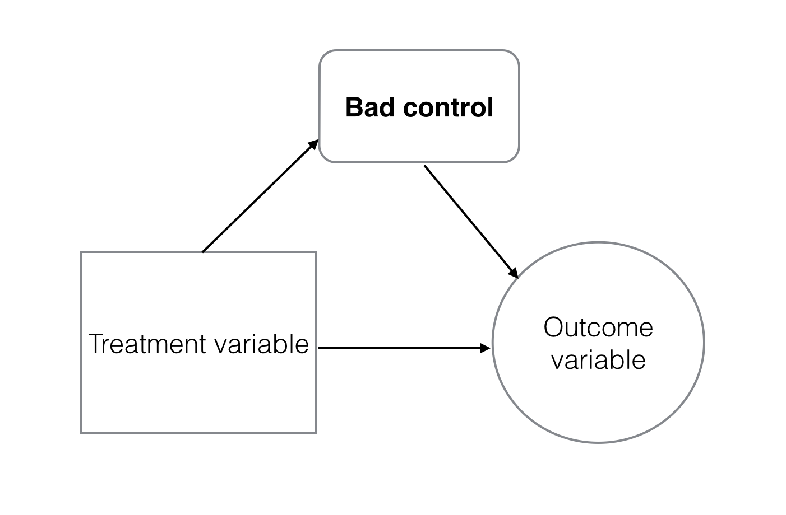


The rule
========================================================

- Run regression 
  - LHS = your dependent variable
  - RHS = your treatment + confounders
  - **Make sure there are no bad controls**
  - Include predictors? Sometimes, but shouldn't make a large impact. 


Natural experiments: a primer
========================================================

Sometimes we don't need to run an experiment. One exists in our observational data. 

- Arbitrary shifts in policy
  - MySuper and super fees
- Unanticipated weather shifts/plagues/lotteries
  - Fish in NY, draft lottery
- Strikes/abrupt changes in input costs
  - Unemployment diaries in Australia
  - Changes in commodity prices

A good natural experiment
========================================================

- Does a reasonable job at predicting differences in the treatment
- Satisfies the "exclusion restriction"
  - Why is it called the exclusion restriction? 

A good natural experiment
========================================================

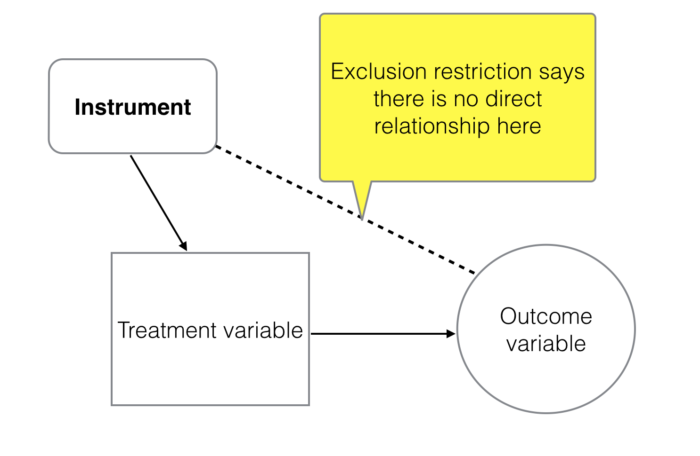

2-stage least squares
========================================================
Idea

- Predict treatment given control variables and instruments
- Use predicted treatment in regression (with controls)

2-stage least squares example
========================================================


```r
library(dplyr); library(AER)
data("CigarettesSW")

CigarettesSW <- CigarettesSW %>%
  mutate(rprice = price/cpi, # Real price adjusted for inflation
         rincome = income/population/cpi, # Real per-capital income
         tdiff = (taxs - tax)/cpi)
```


2-stage least squares example
========================================================

### ivreg syntax

`dependent_variable ~ endogenous_var + confounders | confounders + instruments`

2-stage least squares example
========================================================


```r
# Simple bivariate regression
model1 <- lm(log(packs) ~ log(rprice), data = CigarettesSW)

# Regression with controls
model12 <- lm(log(packs) ~ log(rprice) + log(income) + year, data = CigarettesSW)

model2 <- ivreg(log(packs) ~ log(rprice) + log(rincome) + year | log(rincome) + tdiff + I(tax/cpi), data = CigarettesSW)
```


Going over estimating the causal impact if you can run an experiment
========================================================
class: small-code
- We can run linear regression: 

\[
\mbox{outcome}_{i} = \beta_{0} + \beta_{1}\mbox{treament}_{i} + \beta\mbox{controls} + \epsilon_{i}
\]

```
model <- lm(outcome ~ treatment + control1 + etc, data = mydata)
```

And the "causal effect" of the treatment on our outcome is the estimate of $\beta_1$


Going over estimating the causal impact if you can run an experiment
========================================================
class: small-code
### Example

```
library(arm)
data(lalonde)


model <- lm(outcome ~ treatment + controls, data = lalonde)

#summary(model)
```


Going over Instrumental Variables again
========================================================

- It is an attempt to find a "natural experiment" in our treatment
- Or an attempt to properly consider the "experiment"
  - Intent to treat
- Idea is to replace **treatment** in our regression with an estimate of the **random component of treatment**.
  - 2SLS: First regression is `treatment ~ instrument + controls`
  - Second regression is `outcome ~ predicted_treatment_from_first_stage + controls`
- We use `ARM::ivreg`


The problem with IV
========================================================


I want to know more
========================================================

### Read this book
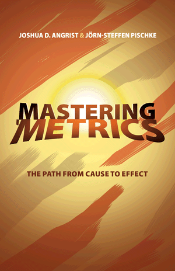

3rd-best techniques
========================================================

- Difference in differences/panel data
  - Idea is to look at a treatment and control group change over time **relative to one another**, with treatment not randomised.
- Propensity score matching
  - Idea is to build a control group that is similar to the treatment group on the observed confounders (controls). 
- Regression with controls (used on Tuesday)
  - We can almost always do better than this. 
  
  
I want to know more
========================================================

### Read this book
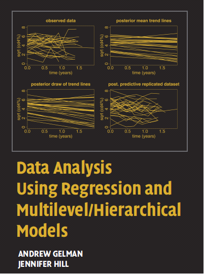


What is panel data?
========================================================

- Multiple observations, multiple units
  - Observe many customers over many periods
  - May have to use week 1's skills to put it in this form!
  

|Individual | Time| Purchases| Letters|Gender | Postcode| Age|
|:----------|----:|---------:|-------:|:------|--------:|---:|
|Nilay      | 2012|        50|       3|F      |     3057|  34|
|Nilay      | 2013|        76|       7|F      |     3057|  35|
|Nilay      | 2014|        33|       2|F      |     3057|  36|
|Lulu       | 2012|        12|       2|F      |     3053|  19|
|Lulu       | 2013|        32|       4|F      |     3053|  20|
|Lulu       | 2014|         0|       3|F      |     3053|  21|


Why is panel data important? 
========================================================
class: small-code
- What is the causal issue in:

```
model <- lm(purchases ~ Letters + Gender + factor(Postcode) + Age, data = mypanel)
```


Why is panel data important? 
========================================================
class: small-code
- What is the causal issue in:

```
model <- lm(purchases ~ Letters + Gender + factor(Postcode) + Age, data = mypanel)
```
- Unobserved confounders: past managers/marketers may have targeted Nilay more, but that doesn't mean that the marketing *caused* her higher purchases. 
  - Maybe she was more likely to both receive marketing *and* make purchases?
  
  
Individual-level "effects"
========================================================

- If we "de-mean" each individual, **we have removed the effect of all unobserved information at the individual level that does not vary over time**. 
  - "de-meaning" is the process of subtracting the average value of the dependent variable for each individual.
  - In the example above, we'd be interested in how an above-average marketing effort would affect Nilay's purchases relative to her average, and Lulu's relative to her average, etc. 
  - This is automated. No need to "de-mean" the data yourself. 
  
  
Introducing the mixed effects model
========================================================

- Mixed effects models make it very easy to pull out individual "effects"
  - Terminology: "effects" are the individual characteristics we never see
 
In a linear model, we have 

\[
y_{i} = \beta_{0} + \beta_{1}x_{1, i} + \beta_{2}x_{2, i} +... + \epsilon_{i}
\]

A panel model has two subscripts: one for the individual $i$, and one for the time, $t$. We can express a model with individual intercepts as

\[
y_{i,t} = \beta_{0,i} + \beta_{1}x_{1, it} + \beta_{2}x_{2, it} +... + \epsilon_{it}
\]


Introducing the mixed effects model
========================================================

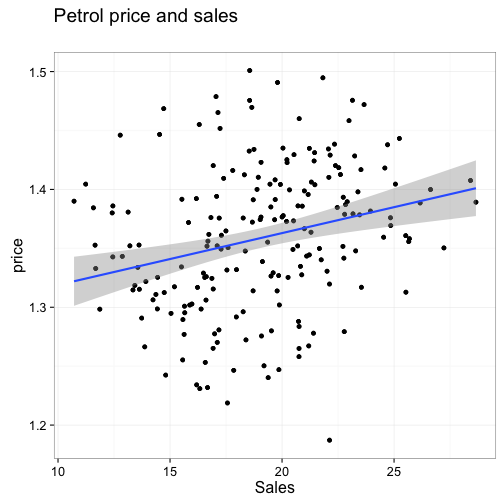


Introducing the mixed effects model
========================================================

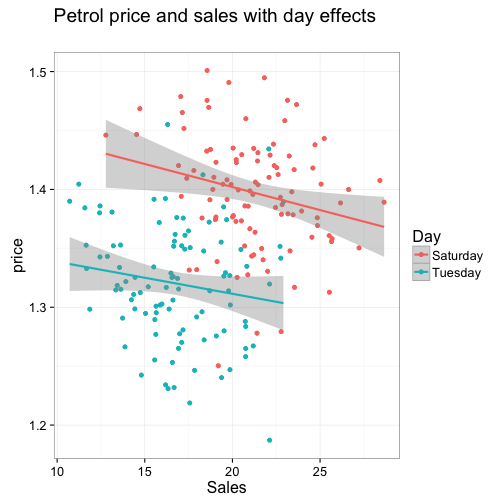

***install.packages(c("lme4", "arm"))***


Implementing the varying-intercepts model in R
========================================================
class: small-code
- We want to estimate the parameter $\beta_1$ in 
\[
\mbox{PostTest}_i = \beta_0 + \beta_1 \mbox{treatment}_{i} + \beta \mbox{controls}_{i} + \epsilon_{i}
\]


```r
library(lme4)

mod2 <- lmer(PostTest ~ Treatment + PreTest + (1 | Grade), data = Electric_company)
#summary(mod2)
```

Note the syntax: All the same, except for the `(1 | Grade)`. 

- The `1` means that we want varying intercepts
- The `| Grade ` says that we want varying intercepts for each grade. 

Implementing the varying-intercepts model in R
========================================================
class: small-code
### We can also have varying treatment effects

**Use the superannuation data**


Relationship to difference-in-differences
========================================================

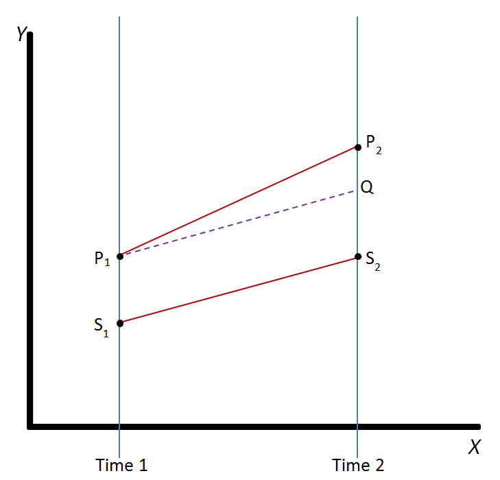

Introducing propensity score matching
========================================================

- Why does an experiment work? 
  - The distribution of counfounders---both measured and unmeasured---is equal across treatment and control. 

If we don't have a natural experiment or panel data, then perhaps it is least bad to build a **synthetic control group**. This will mean that our control group and treatment group are similar **on observed confounders**. 

Incomplete overlap
========================================================

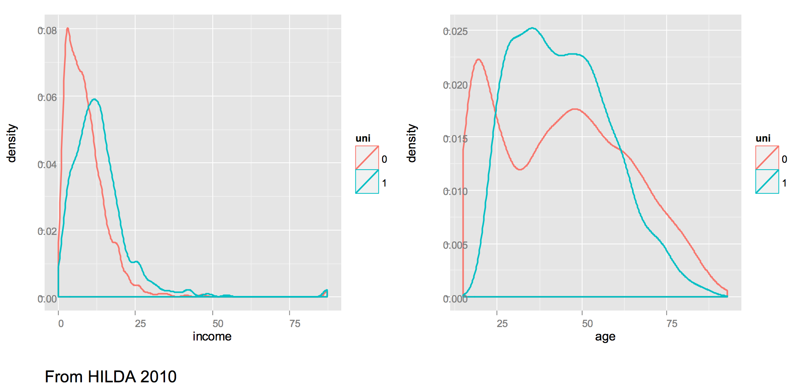

So how do we create a matched control? 
========================================================

### "Exact matching" or "complete matching"

- Match each graduate man with a non-graduate man
  - Match each 25 year old graduate man with a 25 year old non-graduate man
      - Match each 25 year old graduate Asian man with a 25 year old non-graduate Asian man
          - ...
- Upside is that you get great balance
- Downside is that you can't match on many confounders. You encounter a "dimensionality problem"


So how do we create a matched control? 
========================================================

### Clustering

- Perform K-nearest-neighbours or some other clustering routine to group together similar people. 
- Estimate "treatment effects" within each cluster

- Good thing is that you'll end up with a fairly balanced control group
- Bad thing is that you will balance on variables that may not matter


We need to "reduce the dimensions"
========================================================

- Difficult to match on many dimensions
- Easy to match on one dimension
- What if we can create a "score" of how similar two people are in terms of their likelihood to get a treatment, based on their characteristics? 
  - If we have a score, we can match on that. 
- We'll call this a **propensity score**. 


Tends to make better control groups
========================================================

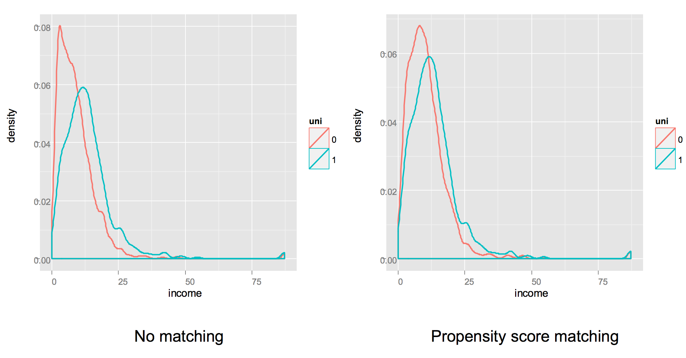


Tends to make better control groups
========================================================
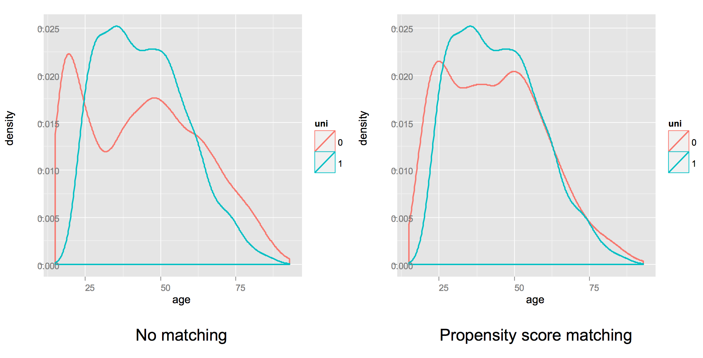


Method
========================================================

1. Build a model that predicts whether someone received the treatment given their (observed) individual characteristics. 
  - The predicted values of this model are the **propensity scores**. 
2. For those **who did** receive the treatment, choose one or many people **who did not** receive the treatment but has a similar propensity score. 
  - Can use many different matching routines (nearest match, "calliper" matching, etc.)
3. Discard unmatched observations
4. Run a regression model on the remainder (treatment + synthetic control)


Does the model estimate the causal effect?
========================================================

### Maybe
- The main assumption is that after controlling for the observed confounders, treatment is as good as random. 
  - Rules out big unobserved confounders. 
- In practice, we include observed covariates because we hope they are correlated with the unobserved ones. 

Does the model estimate the causal effect?
========================================================

### Critiques
- The Smith-Todd critique: If your model of treatment is not **robust** (changes a lot if you include/exclude covariates), your causal estimate will not be robust. 
  - Use regularised GLM for feature selection! 
- Miller Savage Tan critique: Two very different people can have a similar propensity score, and so propensity score matching does not efficiently balance treatment and control groups. 
  - We can use proximity scores from a Random Forest for better matching; has the strengths of exact matching *and* propensity score matching. 


Implementing propensity score matching in R
========================================================
class: small-code

```r
library(arm)
data("lalonde")

# First model: Predict treatment given demographic characteristics
propensity_model <- glm(treat ~ age + I(age^2) + educ + black + hisp + married + nodegr, 
                        data = lalonde, 
                        family = binomial(link = "logit"))

# Get the propensity scores
lalonde$propensity_score <- predict(propensity_model, type = "response")

# Generate matches
matches <- matching(z = lalonde$treat, score = lalonde$propensity_score)

# Subset the data
lalonde_matched <- lalonde[matches$matched,]
```


Implementing propensity score matching in R
========================================================


```r
# Run the two models
# Unmatched data
model_unmatched <- lm(re78 ~ treat + . - propensity_score, data = lalonde)
# Matched data
model_matched <- lm(re78 ~ treat + . - propensity_score, data = lalonde_matched)

# What was the original estimate of the treatment effect?
summary(model_unmatched)
# Has it changed? 
summary(model_matched)
```


You should go and learn my method! 
========================================================

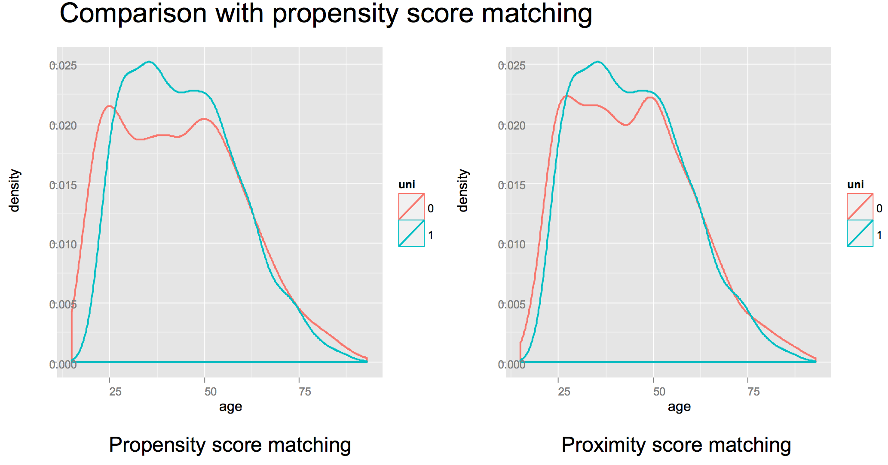
